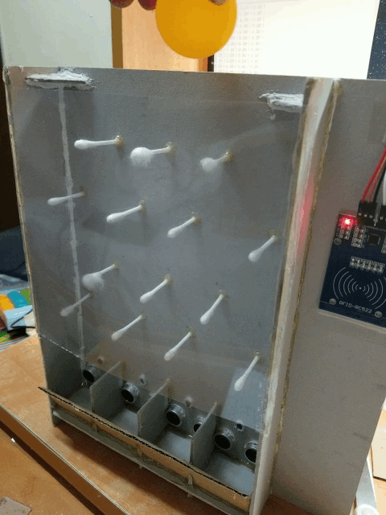
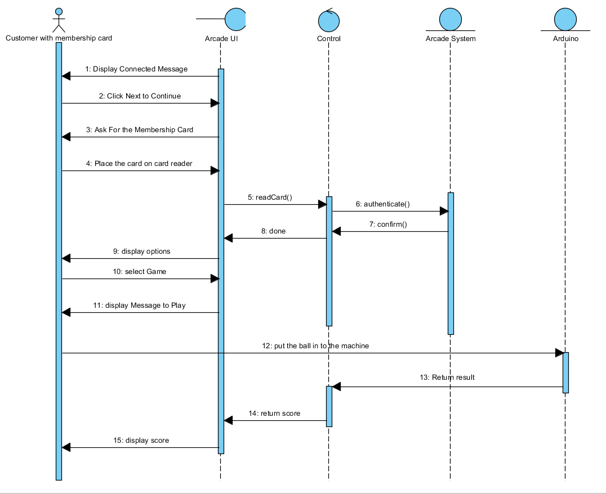
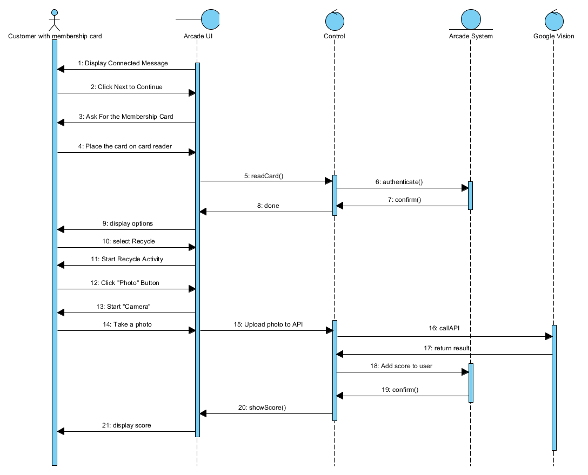
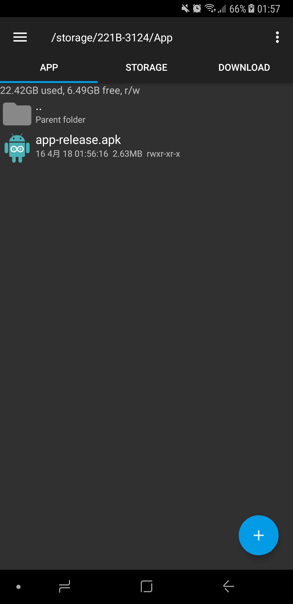
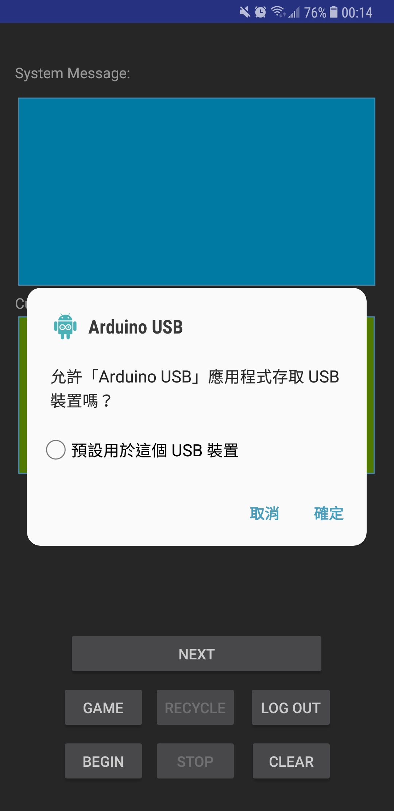

# Arduino-App-FYP-

### Project Background & Description
This project is a sub system of the Final Year Project, which is an Android mobile application that provides two main functions: gaming and recycling. The App works together with Arduino to perform the main functions.

### Gaming
*The final product:*  

A simple entertaining arcade machine for user to get discount by playing the game. User can use and control the machine through the Android App. It starts when user put the RFID card to the reader. When the machine recognizes the user, they can start playing the game. User need to put a ball to get a random discount. After the ball falls into a random hole, user can get the corresponding discount according the hole. Then, the Arduino will send back the data to the mobile app and also update the database. 

*Sequence Diagram for Gaming:*  

### Recycling
This is another method to provide discount to user. We encourage user to bring used plastic bottle or aluminum can to the machine and do recycling. User need to be authenticated by placing their RFID card onto the RFID reader. After that user need to select “recycle” button to start the activity. Then, user need to put the object in front of the camera. The mobile App will take a photo and use Google Cloud Vision API to do object recognition. If a plastic bottle or aluminum can is recognized, user will get reward in form of discount.

*Sequence Diagram for Recycle:*  

### Cap Screen of the Application

<table>
  <tr>
    <td>
      apk need to be installed:  
      
    </td>
    <td>
      Grant Permission:  
      
    </td>
  </tr>
    <tr>
    <td>
      Card Reader:  
      
    </td>
    <td>
      Select Action:  
      
    </td>
  </tr>
  <tr>
    <td>
      Close Connection:  
      
    </td>
    <td>
      Final Layout:  
      
    </td>
  </tr>
</table>
